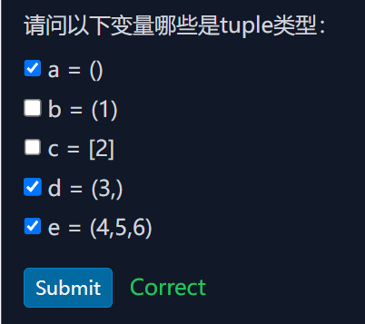

# 1.list
`list`是Python中内置的一个数据类型，`list`是一种有序合集，可以随时增加和删除其中的元素
```python
letter=['a','b','c']
print(letter) #输出的结果为：['a', 'b', 'c']
```
>## 1.1其中变量`letter`是一个`list`,也可以用之前在字符串之间数字符数量的`len()`函数来数list列表中的元素个数，也就是数组的长度
```python
letter=['a','b','c']
print(len(letter)) #输出为3
```
>## 1.2可以用索引来指定列表中的某一个元素位置，索引是从0开始计算的，和c语言中的数组是一样的
```python
letter=['a','b','c']
print(letter[0]) #a
print(letter[1]) #b
print(letter[2]) #c
```
>## 1.3当索引超出数列的编号时就会弹出`IndexError`的错误，所以弄最后一位的索引时可以用`len(letter)-1`来避免超出范围
```python
letter=['a','b','c']
print(letter[len(letter)-1])
print(letter[3])
```
输出结果为:
```python
c
Traceback (most recent call last):
  File "e:/code/learning.py", line 3, in <module>
    print(letter[3])
          ~~~~~~^^^
IndexError: list index out of range
```
>## 1.4同时索引除了可以正真1,2,3这样的列，也可以倒着用-1，-2，-3这样来列
```python
letter=['a','b','c'] 
print(letter[-1]) #输出为c
print(letter[-2]) #输出为b
print(letter[-3]) #输出为a
```
>## 1.5`list`是一个可变的有序表，直接添加是直接增加到`list`的末尾，用的是`append()`的这个函数来插入到`list`的末尾，也可以直接把新的元素添加到指定的位置，用的`insert()`这个函数，如果要删除`list`末尾的元素，则是用`pop()`这个函数,也可以直接给出list的索引位置，来替换更新该位置的元素
```python
name=['a','b','c']
name.append('cuit1')
print(name) #['a', 'b', 'c', 'cuit1']
name.insert(1,'cuit2')
print(name) #['a', 'cuit2', 'b', 'c', 'cuit1']
name.pop()
print(name) #['a', 'cuit2', 'b', 'c']
name[0]='cuit1'
print(name) #['cuit1', 'cuit2', 'b', 'c']
```
>## 1.6在`list`中元素可以是不同的数据类型，`list`里面也可以包含其他`list`,如果要计算list中的元素个数，则是把其中包含的`list`看成一个整体，来算做一个元素来看待，即使在`list`里面再嵌套一个`list`，他也只算最外层的那一个，如果数组为空的，其数组的长度就是0
```python
name=[123,'cuit',True,['a','b','c',['a1','b1']]]
print(len(name)) #输出的结果为4
```
```python
name=[]
print(len(name)) #输出结果为0
```
>## 1.7在`list`中嵌套了列表过后可以用`[][]`这样的形式来表示索引，同时也可以表达是一维数组，二维数组，三维数组这样的意思
```python
p=['a','b','c']
name=[123,'cuit',p,True]
print(len(name)) #输出为4
print(name[2][0]) #输出为a
print(p[0]) #输出为a
```
# 2.tuple
`tuple`也是一种有序列表，叫元组，和`list`有相近之处，设置元组是用的圆括号，不是方括号，但是元组经过初始化设置后就不能再更改，就没有像`list`中有`append()，insert()，pop()`这样的内置函数了，但是索引来确定位置来进行打印输出是不影响的，`tuple`初始化过后不能更改的意义，代码就更加安全，不会被任意更改
```python
name=('abc',123,True)
print(len(name)) #输出为3
print(name[1]) #输出为123
print(name[-2]) #输出为123
```
>## 2.1`tuple`的陷阱
>### 2.1.1当设置一个`tuple`时，`tuple`里面的元素就应该确定下来,如果要定义一个空的`tuple`时，可以写成`()`
```python
name=()
print(name) #输出为()
print(len(name)) #输出为0
print(type(name)) #输出为<class 'tuple'>
```
>### 2.1.2当设置的`tuple`中里面只包含了一个元素，你如果直接写进去，按照Python的语法它会给你算作直接给那个变量赋值，而不是把这个变量设置为`tuple`类型
```python
name=(1)
print(name) #输出为1
print(type(name)) #输出为<class 'int'>
```
除了`int`类型，`bool`和`str`类型也是一样的，不能被成功初始化为`tuple`类型
```python
name=(True)
print(name) #输出为True
print(type(name)) #输出为<class 'bool'>
name=('cuit')
print(name) #输出为cuit
print(type(name)) #输出为<class 'str'>
```
因此为了在设置一个元素的`tuple`时，在元素后面加一个`,`就可以解决
```python
name=(123,)
print(name) #输出为(123,)
print(type(name)) #输出为<class 'tuple'>
name=(True,)
print(name) #输出为(True,)
print(type(name)) #输出为<class 'tuple'>
name=('cuit',)
print(name) #输出为('cuit',)
print(type(name)) #输出为<class 'tuple'>
```
这样无论元素是什么类型，这个变量就始终为`tuple`类型
>### 2.1.3存在一个相对而言来说的可变的`tuple`，是在`tuple`里面的元素中嵌套一个`list`，这样就只可以进行对`tuple`进行更改，更改的内容也只是在`list`内
```python
p=['a','b','c']
name=(123,'cuit',p,True)
print(name) #输出为(123, 'cuit', ['a', 'b', 'c'], True)
print(len(name)) #输出为4
name[2][0]='x'
p[1]='y'
print(name) #输出为(123, 'cuit', ['x', 'y', 'c'], True)
```
看似是`tuple`中的元素变了，变了的其实是`tuple`中`list`中的元素，`tuple`的不变指的是是其对应的元素没有变，以上面的代码为例，`tuple`里存的那4个引用（内存地址）一个都没变，变的是其中第3个引用所指向的列表对象内部的数据,因为`list`里面的元素是可变的
# 3.练习
## 3.1
```python
L = [
    ['Apple', 'Google', 'Microsoft'],
    ['Java', 'Python', 'Ruby', 'PHP'],
    ['Adam', 'Bart', 'Bob']
]

# 打印Apple:
print(?)
# 打印Python:
print(?)
# 打印Bob:
print(?)

```
```python
L = [
    ['Apple', 'Google', 'Microsoft'],
    ['Java', 'Python', 'Ruby', 'PHP'],
    ['Adam', 'Bart', 'Bob']
]
print('{},{},{}'.format(L[0][0],L[1][1],L[2][2]))
```
## 3.2
