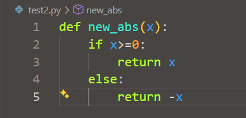

# 1.定义函数
在python中定义一个函数，首先是要用`def`语句，依次写入函数名，括号，括号中的参数，然后冒号，最后返回值的返回值用`return`返回
自定义函数来实现原先自带函数`abs`的功能
```python
def new_abs(x):
    if x>=0:
        return x
    else:
        return -x
```
如果定义的函数里没有写返回语句，函数里面的语句会正常执行，然后再返回一个`None`
```python
def say_hello():
    print(f'hello')
print(say_hello())
```
输出的结果为：
```python
hello
None
```
还可以将函数的定义保存到其他文件里，后面用`from...import...`的语法来引入函数
```python
def new_abs(x):
    if x>=0:
        return x
    else:
        return -x
```

```python
from test2 import new_abs
print(new_abs(-99)) # 输出为99
```
# 2.空函数
如果想定义一个什么都不做的函数或者说是还没有想好用什么函数，就可以使用空函数，使用`pass`语句
```python
def hello():
    pass
```
这样是不影响代码正常运行的，在`if`语句里面用`pass`语句也是不影响正常程序运行的
```python
if age>=18:
    pass
```
如果想表达这个代码块返回的是空白的，就可以直接写`pass`
# 3.参数检查
## 3.1 参数数量
调用函数时，如果参数数量不对，python解释器会自动跳出来，进行检查，并抛出`TypeError`
```python
def new_abs(x):
    if x>=0:
        return x
    else:
        return -x
print(new_abs(1,2))
```
其抛出的`TypeError`为：
```python
Traceback (most recent call last):
  File "e:\code\learning.py", line 95, in <module>
    print(new_abs(1,2))
          ~~~~~~~^^^^^
TypeError: new_abs() takes 1 positional argument but 2 were given
```
## 3.2参数类型
如果是填入函数的参数类型不对，python自带的函数就会返回出是填入的参数类型不对，如果是之前写的这种自定义函数就不会返回出是写入的参数类型不对
以之前写的new_abs(x)和abs(x)对比：
```python
def new_abs(x):
    if x>=0:
        return x
    else:
        return -x
print(new_abs('A'))
```
其输出的结果为：
```python
Traceback (most recent call last):
  File "e:\code\learning.py", line 95, in <module>
    print(new_abs('A'))
          ~~~~~~~^^^^^
  File "e:\code\learning.py", line 91, in new_abs
    if x>=0:
       ^^^^
TypeError: '>=' not supported between instances of 'str' and 'int'
```
```python
print(abs('A'))
```
其输出的结果为：
```python
Traceback (most recent call last):
  File "e:\code\learning.py", line 95, in <module>
    print(abs('A'))
          ~~~^^^^^
TypeError: bad operand type for abs(): 'str'
```
当输入了不对应类型的参数后，abs函数返回的参数类型的错误信息，而new_abs返回的是if条件判断语句的错误信息，出错的信息和abs函数是不一样的，所以现在直接这样来定义新的函数还是不够稳健的

对于new_abs函数数据类型的限制参考abs，则数据类型只考虑整数和浮点数，数据类型的检查可以依靠内置的`isinstance()`函数来实现，其中的`raise`语句的意思就是相当于抛出来一个错误
```python
def new_abs(x):
    if not isinstance(x,(int,float)):
        raise TypeError('参数类型错误')
    if x>=0:
        return x
    else:
        return -x
print(new_abs('A'))
```
其返回的信息为：
```python
Traceback (most recent call last):
  File "e:\code\learning.py", line 104, in <module>
    print(new_abs('A'))
          ~~~~~~~^^^^^
  File "e:\code\learning.py", line 99, in new_abs
    raise TypeError('参数类型错误')
TypeError: 参数类型错误
```
这个就是添加了参数检查后的效果
# 4.返回多个值
函数是可以返回多个值的，例如像围棋这样的程序在平面是有x与y轴两个坐标的，用函数来表示坐标位置的移动，就是函数返回多个值
```python
import math
def move(x,y,step,angle=0):
    angle=math.radians(angle)# 角度->弧度
    nx=x+step*math.cos(angle)
    ny=y+step*math.sin(angle)
    return nx,ny
x,y=move(1,2,1,45)
print(f'{x:.1f},{x:.1f}')# 输出为1.7,1.7
```
这个看似是是输出了两个变量，实际上只是一个元组`tuple`
```python
import math
def move(x,y,step,angle=0):
    angle=math.radians(angle)
    nx=x+step*math.cos(angle)
    ny=y+step*math.sin(angle)
    return nx,ny
r=move(1,2,1,45)
print(r)# 输出为(1.7071067811865475, 2.7071067811865475)
```
返回一个`tuple`可以省略括号，而多个变量可以同时接收一个`tuple`，按位置赋给对应的值，所以，Python的函数返回多值其实就是返回一个`tuple`，但写起来更方便
# 5.练习
请定义一个函数`quadratic(a, b, c)`，接收3个参数，返回一元二次方程$ax^2+bx+c=0$的两个解
提示：

一元二次方程的求根公式为：
$$x = \frac{-b \pm \sqrt{b^2 - 4ac}}{2a}$$
计算平方根可以调用math.sqrt()函数：
```python
>>> import math
>>> math.sqrt(2)
1.4142135623730951
```
```python
import math

def quadratic(a, b, c):
    pass

# 测试:
print('quadratic(2, 3, 1) =', quadratic(2, 3, 1))
print('quadratic(1, 3, -4) =', quadratic(1, 3, -4))

if quadratic(2, 3, 1) != (-0.5, -1.0):
    print('测试失败')
elif quadratic(1, 3, -4) != (1.0, -4.0):
    print('测试失败')
else:
    print('测试成功')
```
---
```python
import math

def quadratic(a, b, c):
    delat=math.sqrt(b*b-4*a*c)
    x1=(-b+delat)/(2*a)
    x2=(-b-delat)/(2*a)
    return x1,x2
# 测试:
print('quadratic(2, 3, 1) =', quadratic(2, 3, 1))
print('quadratic(1, 3, -4) =', quadratic(1, 3, -4))

if quadratic(2, 3, 1) != (-0.5, -1.0):
    print('测试失败')
elif quadratic(1, 3, -4) != (1.0, -4.0):
    print('测试失败')
else:
    print('测试成功')
```